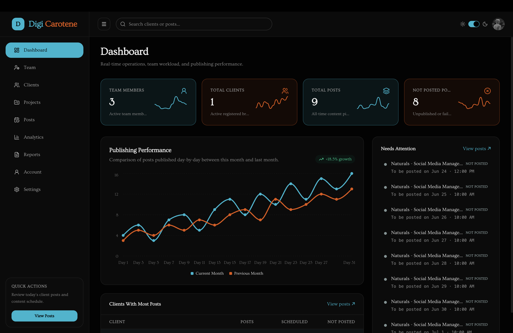

# Digi Carotene Hub — Content Calendar & Agency Operations

A premium, full-featured digital marketing agency operations dashboard and client portal. Digi Carotene Hub streamlines workflows between agency specialists (admins/managers) and registered brands (clients) with real-time calendars, publishing performance analytics, and workload tracking.



## Key Features

### 1. Public Landing Page & About Page
- **Modern UI/UX**: Sleek dark-themed design matching the dashboard's aesthetic with glowing accents, responsive layouts, and interactive elements.
- **Services Showcase**: Detailed marketing service highlights with custom Lucide icons.
- **Interactive Hero Widget**: A mock live operations preview featuring real-time stats and a publishing performance chart.
- **Portals Access**: Clear entry points for both the **Client Portal** and **Team Portal**.
- **Contact Form**: Interactive form with toast notifications on successful submission.

### 2. Admin & Team Management Workspace
- **Real-time Dashboard**: Live metrics for team members, total clients, total posts, and missed posts, complete with custom sparklines.
- **Publishing Performance Chart**: Beautiful dual-line Recharts visualization comparing current and previous month publishing rates.
- **Team Management**: Comprehensive CRUD for agency specialists, featuring roles (`executive`, `manager`, `admin`), contact details, and project history.
- **Client Assignments**: Track active and historical project assignments for each team member.

### 3. Client Portal Workspace
- **Dedicated Dashboard**: Tailored view for registered brands to track their active campaigns and scheduled posts.
- **Content Calendar**: Interactive week and day-based calendar views with status-aware post cards (`Not posted`, `Scheduled`, `Posted`).
- **One-Click Approvals**: Streamlined client approval workflow for scheduled content.

### 4. Advanced Analytics & Reporting
- **Performance Analytics**: Detailed tabbed analytics views with custom linear sparklines displaying real-time-like data trends.
- **Status Reporter**: Daily status reports and email preview dialogs for client updates.

---

## Tech Stack

- **Frontend**: React, React Router v7, Tailwind CSS, Shadcn UI
- **Data Visualization**: Recharts (with custom linear/angular sparklines)
- **Icons**: Lucide React
- **Backend & Database**: Supabase (PostgreSQL, Row Level Security, Real-time)
- **Build Tool**: Bun / Vite

---

## Getting Started

### 1. Install Dependencies
```bash
bun install
# or
npm install
```

### 2. Set Up Supabase

Run in Supabase **SQL Editor**:

- **New project:** [`scripts/migrations/001_initial_schema.sql`](scripts/migrations/001_initial_schema.sql)
- **Existing project:** apply only missing files from [`scripts/migrations/`](scripts/migrations/) (see README there)

See [docs/database.md](docs/database.md) and [docs/README.md](docs/README.md) for schema details and DTOs.

### 3. Start the Development Server
```bash
bun run dev
# or
npm run dev
```

### 4. Build for Production
```bash
bun run build
# or
npm run build
```

---

## Project Structure

```
src/
  app/              Router, App shell, global styles
  features/         Feature modules (staff-dashboard, client-portal, public, team-management, etc.)
  shared/           Cross-feature UI (Shadcn), layouts, utils, and toast helpers
docs/               Schema, DTOs, and feature docs (see docs/README.md)
  staff-portal/     Per-feature docs under docs/staff-portal/<feature>/
scripts/migrations/ Numbered SQL migrations (001 = full schema for new projects)
```
